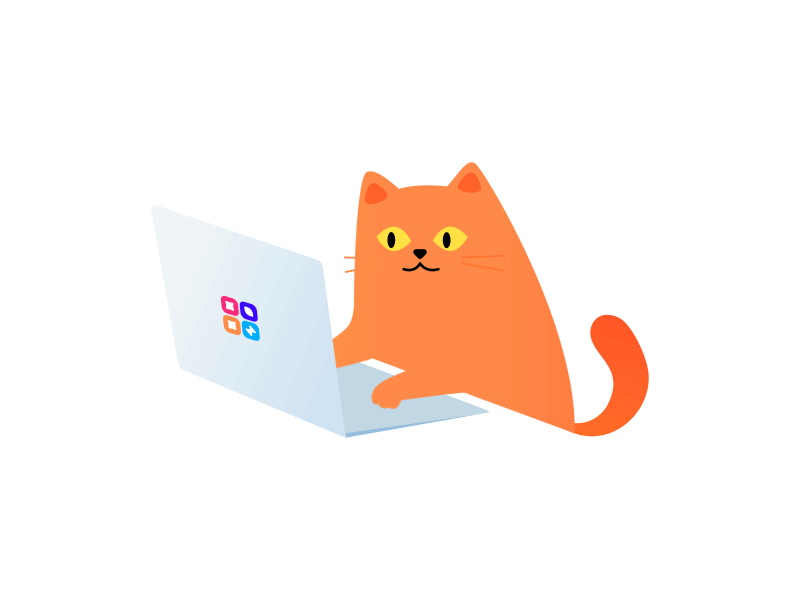

<h1 align="center">"Once I dreamt.."</h1>

 We were dear to one another, whole and certain, our laughter spilling over the edges of ordinary days, our silences folded into a language only we knew. I woke to find the dream had slipped through my fingers, like fine sand falling through an hourglass, and suddenly we were strangers, and the space between us was silent, thick with all the words we never spoke.

I have said all I could.
Words fell like autumn leaves, one by one,
spiraling to the ground until only emptiness remained.
I traced the shape of your absence in the quiet corners of the room,
counting every shadow, every faint memory of your voice,
wondering if you too felt the hollow echo of what we were.

For me, you are the sun,
around which I build my fragile paradise,
a world held together by fragments of your warmth.
To you, I am but a passing shadow,
a fragment unnoticed in the stories of your days.
I am not essential — not even for the greater good —
only a quiet echo fading into nothing,
a memory that lingers on the edges of your mind
long after the color has drained from the sky.

And yet, I cannot turn away.
I linger in the corners of imagined conversations,
in the spaces between moments that will never come,
holding onto a dream that no longer exists,
while knowing, painfully,
that the world you inhabit spins on without me,
bright, indifferent, unbroken.

Perhaps this is love’s cruelest truth:
to matter so profoundly to one heart,
and so little to the other.
And still, we lived, we loved, we existed together —
if only in a time that has quietly unraveled,
leaving me with nothing but the echo of your presence,
and the soft ache of knowing
that sometimes, to hold someone in your heart
is to know you will never hold them at all.

 

# Hello, I'm First! 👋

Welcome to my GitHub!  

I'm a passionate developer from Thailand 🇹🇭, currently exploring **programming, and AI/automation technologies**.  
I love building projects that are both **practical and elegant**, and I enjoy learning through hands-on experience.  

I’m currently working on **ZyGen Company Limited**

<h3 align="left">Connect with me:</h3>

  

 
<h2 align="left">Languages & Tools:</h2>

<b>Frontend:</b>

<b>Backend:</b>

<b>Databases:</b>

<b>Tools & Design:</b>

 

<h2>GitHub Overview</h2>

&nbsp;

